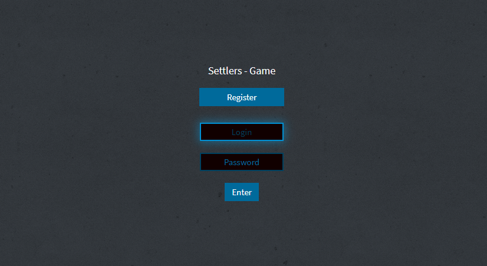
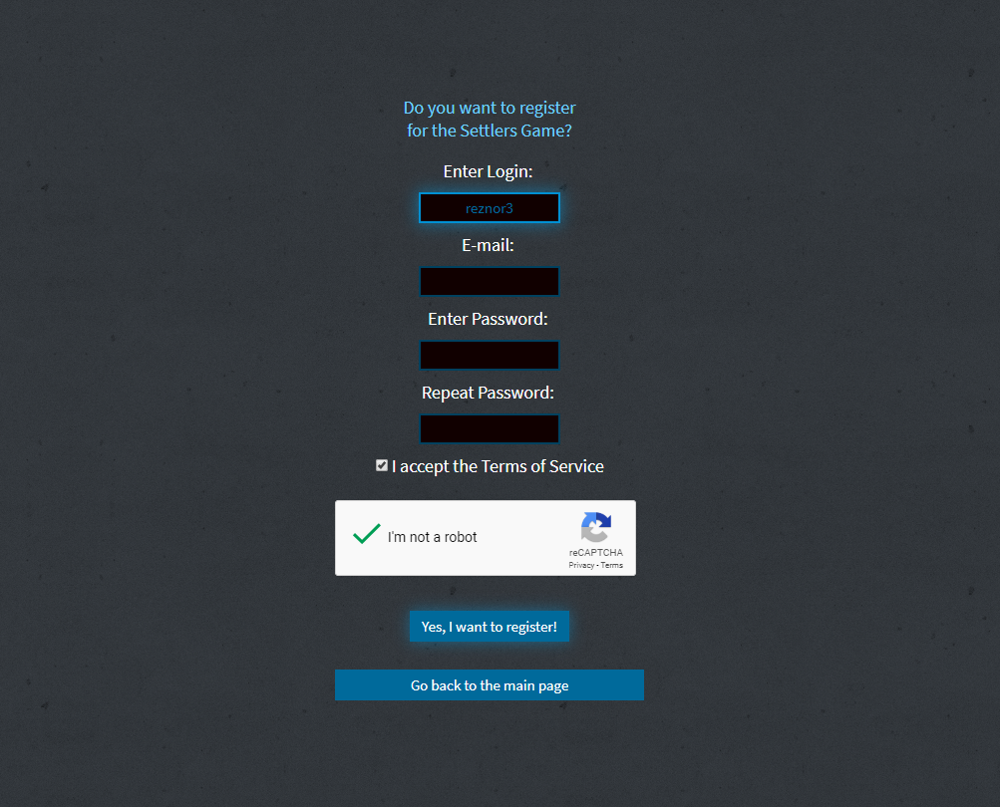
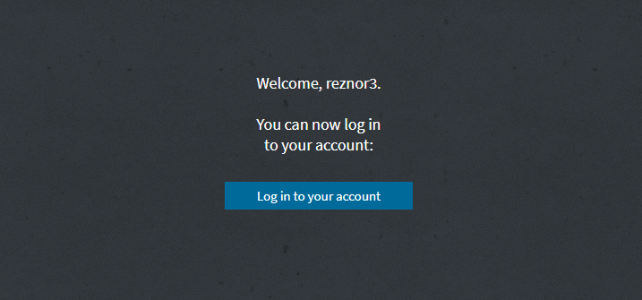
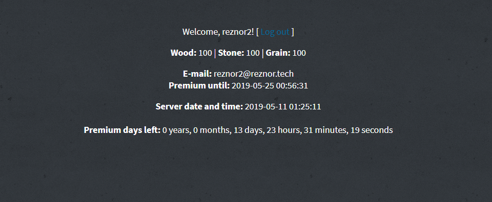

# Learning PHP - Register, Login, Validate

> Training course - Pasja Informatyki, PHP course, episode 2, 3 and 4 ( [Link 2](https://www.youtube.com/watch?v=Pp578w7C9hE) [Link 3](https://www.youtube.com/watch?v=fMJw90n8M60) [Link 4](https://www.youtube.com/watch?v=U-LqhOrkkq8) )

## General info

Learning PHP, back-end and working with databases.
Login page. Registration of new users. Validation of password. Password hashing. Terms and Conditions check. Google reCAPTCHA. SQL injection security - code sanitization. E-mail validation. Password length and login length check. Database connection. Inserting new registered users into database. Checking if user already exists. Exception handling. Reading values from database and displaying in HTML. Date and time handling, checking and validation. Associative arrays. Page redirection. Logging in users. Remembering Sessions between pages. Logging out (unsetting session).

## Technologies

* HTML5
* CSS
* PHP
* MySQL
* xampp
* phpmyAdmin
* Google reCaptcha
* Notepad++
* Microsoft Visual Studio Code

## Screenshots

## Contact

[ReznoRMichael](https://github.com/ReznoRMichael)